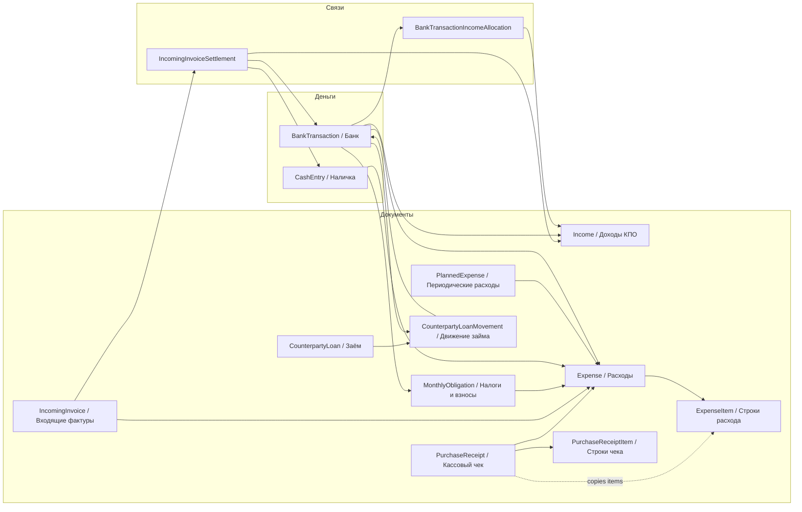

# Handoff Context — Buh_Prosp

Дата подготовки: 2026-06-03  
Текущая ветка: `main`  
Последний известный коммит: `0a7519f Add receipt search and sorting`
Рабочая папка: `D:\Work\Programming\Buh_Prosp`

Этот файл нужен, чтобы проверить контекст, при необходимости отредактировать его и начать следующую ветку без потери решений и договорённостей.

## 1. Жёсткие правила проекта

- Все изменения схемы БД делаются только вручную через отдельные скрипты в `manual_migrations`.
- Нельзя добавлять автоматические миграции в runtime-приложение и множить legacy-код в роутерах/сервисах.
- Боевой сервер: `192.168.10.20`.
- Боевая БД находится на сервере в `D:\Program\ProspEl\prospel.db`.
- Скрипт обновления `!update_prod.cmd` делает backup, pull, install/build/restart, но не запускает миграции БД.
- Перед ручной миграцией на сервере должен быть backup. В update script backup уже создаётся, но для one-shot migration лучше иметь отдельный backup от самого скрипта.
- В git не трогать чужие незакоммиченные изменения без проверки diff.
- Если появляется `.git\index.lock`, сначала проверить, что нет активного git-процесса, потом можно удалить stale lock.

## 2. Как продолжать из новой ветки

Рекомендуемый старт:

```powershell
git switch main
git pull origin main
git switch -c codex/<short-task-name>
```

Для сервера после перехода на `main`:

```powershell
git fetch origin
git switch main
git pull origin main
.\!update_prod.cmd
```

Если нужна миграция БД, её запускать отдельно из `manual_migrations`.

## 3. Что уже находится в `main`

### 3.1. Кассовые чеки

Добавлен модуль `Кассовые чеки`:

- Импорт по QR URL с `suf.purs.gov.rs`.
- Сохранение ссылки на чек и кнопка `Открыть чек`.
- Список позиций чека.
- Удаление ошибочно добавленного чека.
- Ручная привязка чека к расходу, включая режим `Все расходы за период`.
- Создание расхода из чека.
- Автоподбор расходов и банковских транзакций.
- Статусы чеков: `new`, `linked_expense`, `waiting_bank`, `matched_bank`, `cash_expense`, `error`.
- Пустые неинформативные поля в модалке чека скрываются.
- Проект у чека и связанного расхода синхронизируется при изменении проекта расхода.
- Способ оплаты чека определяется из сохранённого HTML журнала SUF: `Gotovina / Готовина` переводит `payment_kind` в `cash`.
- Новые наличные чеки в режиме создания расхода `auto` создают `Expense(source="cash", status="paid")` и `CashEntry(direction="out", entry_type="expense")`.
- Для старых чеков со статусом `Ждет банк` добавлено ручное действие `Оплачено наличкой`.
- Для ошибочно отмеченного наличного чека добавлено действие `Вернуть в ожидание банка`, которое удаляет связанную наличную запись и возвращает расход в `planned`.
- В списке кассовых чеков добавлена сортировка по видимым колонкам: дата, продавец, номер фактуры, способ оплаты, проект, сумма, статус.
- Поиск на странице чеков ищет по полям списка и связям: сумма в разных форматах, проект, продавец, ПИБ, адрес, номер, способ оплаты, статус, id связанных расхода/банка/налички. Поиск по позициям товаров намеренно не включён.
- Проверен класс проблем со скрытым `limit` на страницах с фильтрами год/месяц: `Расходы`, `Доходы (КПО)` и `Наличка` теперь без явного `limit` отдают весь выбранный период. `Банк` и `Входящие фактуры` уже не имели такого лимита.

Ключевые файлы:

- `backend/models.py`: `PurchaseReceipt`, `PurchaseReceiptItem`.
- `backend/receipt_service.py`.
- `backend/routers/receipts_router.py`.
- `frontend/src/pages/Receipts.jsx`.
- `frontend/src/api.js`: `api.receipts`.
- `frontend/src/i18n.js`: русские/сербские labels.

### 3.2. Android-приложение для QR

В проект добавлена папка `android-app`.

Назначение приложения:

- На телефоне сканировать QR кассового чека.
- Автоматически отправлять URL в web/backend.
- После успешного сканирования: виброотклик, beep, автоотправка, очистка URL и автоскрытие сообщения об успехе.
- Добавлена иконка приложения.

Проверка сборки ранее выполнялась через Gradle wrapper.

### 3.3. Расходы с позициями

Добавлена сущность `ExpenseItem`, чтобы расход мог хранить табличные строки, а не только один текст description.

Реализовано:

- `Expense.items` relationship.
- `ExpenseItem` в модели.
- Схемы `ExpenseItemCreate`, `ExpenseItemResponse`.
- `ExpenseCreate.items`, `ExpenseUpdate.items`, `ExpenseDetailResponse.items`.
- Создание/редактирование расхода с несколькими позициями.
- Добавление/удаление строк расхода в UI.
- Сумма расхода считается по строкам, если строки заполнены.
- Description fallback строится из первых строк, если описание пустое.
- При создании расхода из кассового чека строки чека копируются в `ExpenseItem`.
- В модалке расхода показывается информативная карточка, таблица строк расхода и кнопка перехода к связанному чеку вместо дублирования `Позиции чека`.

Ключевые файлы:

- `backend/models.py`: `ExpenseItem`.
- `backend/schemas.py`: expense item schemas.
- `backend/routers/expenses_router.py`.
- `backend/receipt_service.py`: copy receipt items to expense.
- `frontend/src/pages/Expenses.jsx`.
- `frontend/src/pages/Receipts.jsx`: открытие чека из state `openReceiptId`.
- `frontend/src/i18n.js`.

### 3.4. Миграция v18

Добавлена ручная миграция:

- `backend/scripts/migrate_v18_expense_items.py`
- `manual_migrations/v18_expense_items.cmd`

Назначение:

- Создать таблицу `expense_items`.
- Backfill: скопировать позиции из `purchase_receipt_items` в `expense_items` для расходов, связанных с чеками.

Dry-run локально был проверен:

```powershell
manual_migrations\v18_expense_items.cmd --dry-run
```

Последний результат dry-run:

```text
[v18] Using DB: D:\Work\Programming\Buh_Prosp\prospel.db
[v18] Dry-run mode: changes will be rolled back.
[v18] Would copy receipt items into expense_items: 0
[v18] Dry-run completed, no changes committed.
```

Важно: на проде после деплоя `main` нужно отдельно запустить v18, если таблица ещё не создана:

```powershell
manual_migrations\v18_expense_items.cmd --dry-run
manual_migrations\v18_expense_items.cmd
```

### 3.5. Займы контрагентам

Добавлен учёт полученных и выданных займов без искажения доходов/расходов:

- отдельные таблицы `counterparty_loans` и `counterparty_loan_movements`;
- банковская строка связывается с движением займа через `matched_type = "loan_movement"`;
- сценарии: получить заём, выдать заём, погасить полученный, получить возврат выданного;
- займы входят в расчёты с контрагентами отдельными колонками (`issued_loans`, `borrowed_loans`);
- тело займа не создаёт `Income`/`Expense` и не меняет P&L;
- cash flow показывает займы отдельными колонками `Финансирование: приток/отток` и учитывает их в закрывающем остатке;
- нельзя менять контрагента у займа после появления движений;
- нельзя добавлять движения к погашенному/отменённому займу;
- race-condition при двойном связывании банковской операции возвращает `409`.
- У займа есть поле `note`; карточка займа показывает и позволяет редактировать общий комментарий через существующий `PATCH /counterparty-loans/{id}`.
- Комментарии движений займа и назначение банковской транзакции показываются в таблице движений.
- Страница `Займы` показывает `Внесение собственных средств`/`Возврат собственных средств` отдельной read-only секцией из уже существующих `BankTransaction` с `matched_type = "owner_funds"`; схема БД для этого не менялась.
- В секции `Собственные средства` на странице `Займы` есть агрегированные итоги `Внесено`, `Возвращено` и `Фирма должна владельцу`. Это нужно, чтобы возвраты собственных средств были видны и сразу был понятен текущий остаток долга фирмы владельцу.
- Таблица `Собственные средства` намеренно компактная: одна строка на движение, видимые колонки `Дата`, `Тип`, `Описание`, `Внесено`, `Возвращено`, `Остаток долга`; нижнего итогового footer нет, общие итоги показываются только в верхних карточках. Длинный контрагент, счёт и банковский референс спрятаны в tooltip строки и доступны в карточке по клику.

Ключевые файлы:

- `backend/models.py`: `CounterpartyLoan`, `CounterpartyLoanMovement`.
- `backend/counterparty_loan_service.py`.
- `backend/routers/counterparty_loans_router.py`.
- `backend/finance_service.py`: financing columns in cash flow.
- `backend/incoming_invoice_service.py`: займы в балансе контрагентов.
- `backend/bank_matching_service.py`, `backend/routers/bank_transactions_router.py`, `backend/link_diagnostics.py`.
- `frontend/src/pages/CounterpartyLoans.jsx`.
- `frontend/src/pages/BankTransactions.jsx`.
- `frontend/src/pages/CashFlow.jsx`.

### 3.6. Миграция v19

Добавлена ручная миграция:

- `backend/scripts/migrate_v19_counterparty_loans.py`
- `manual_migrations/v19_counterparty_loans.cmd`

Назначение:

- создать таблицы `counterparty_loans` и `counterparty_loan_movements`;
- создать индексы для типа/статуса/дат/контрагента/движений;
- создать partial unique index на `counterparty_loan_movements.bank_transaction_id`, если ссылка банка не `NULL`.

Важно: на проде после деплоя `main` нужно отдельно запустить v19, если таблицы ещё не созданы:

```powershell
manual_migrations\v19_counterparty_loans.cmd --dry-run
manual_migrations\v19_counterparty_loans.cmd
```

### 3.7. Входящие фактуры и банк

Важные уже внесённые изменения:

- Закрытие входящей фактуры банком сделано через стандартный pathway `settle_via_bank`.
- Ранее была проблема: банк мог создавать settlement напрямую и обходить проверки. Исправлено.
- При успешной привязке банк-модалка закрывается автоматически.
- Для входящих фактур улучшен список: итоги вынесены вверх, добавлен проект, общий стиль ближе к `Доходы (КПО)`.
- В модалках входящих фактур добавлены реквизиты оплаты/связанные операции, чтобы понимать, почему статус `Оплачено`.

Ключевые файлы:

- `backend/incoming_invoice_service.py`
- `backend/bank_matching_service.py`
- `backend/routers/incoming_invoices_router.py`
- `frontend/src/pages/IncomingInvoices.jsx`
- `frontend/src/pages/BankTransactions.jsx`

### 3.8. Диагностика связей

Добавлена read-only диагностика связей:

- `backend/link_diagnostics.py`
- endpoint в service/router, если подключён в текущей версии.

Цель:

- Находить битые `BankTransaction.matched_id`.
- Находить `IncomingInvoiceSettlement` с отсутствующими linked rows.
- Находить `PurchaseReceipt` с отсутствующим расходом/банком/наличкой.
- Находить `Expense.source="receipt"` без связанного чека.
- Находить рассинхрон статусов чеков.
- Находить битые связи `loan_movement`.

Перед большими правками логики связей нужно запускать диагностику и сохранять baseline.

### 3.9. Финансовая аналитика

Уже исправлялись:

- Расчёт лимитов паушала.
- Разделение `по начислению` / `по деньгам` вместо непонятных `accrual/cash`.
- Панель/Финансы/P&L пересматривались на корректность.
- Блок предупреждения о лимитах упрощён: риск отображается визуально на самом блоке лимита.
- В cash flow добавлены отдельные колонки финансирования по займам, без попадания principal в revenue/expense.

Ключевые файлы:

- `backend/finance_service.py`
- `backend/routers/dashboard_router.py`
- `frontend/src/pages/FinanceOverview.jsx`
- `frontend/src/pages/Dashboard.jsx`
- `frontend/src/pages/ProfitAndLoss.jsx`

### 3.10. Backup

В `Настройки / Сервис и backup` добавлена возможность скачать backup.

Ключевые файлы:

- `frontend/src/pages/Settings.jsx`
- `frontend/src/api.js`
- backend service/router для backup.

## 4. Последние проверки

Последние локальные проверки перед handoff:

```powershell
.\venv\Scripts\python.exe -m compileall backend
npm --prefix frontend run build
manual_migrations\v18_expense_items.cmd --dry-run
.\venv\Scripts\python.exe backend\scripts\migrate_v19_counterparty_loans.py --dry-run
```

Результат:

- Backend compile: успешно.
- Frontend build: успешно.
- Vite warning про большой bundle остаётся стандартным предупреждением, не ошибкой.
- v18 dry-run: успешно.
- v19 dry-run: успешно.
- In-memory сценарий займов/cash flow: успешно.
- In-memory сценарий наличной оплаты чека `waiting_bank -> cash_expense -> waiting_bank`: успешно.

Файл старого плана `EXPENSE_ITEMS_IMPLEMENTATION_PLAN.md` удалён после проверки выполнения.

## 5. Текущий граф документооборота



## 6. Известные инварианты

- Кассовый чек сам по себе является документом подтверждения расхода.
- Поэтому чек должен иметь связанный расход сразу после импорта или после ручного действия пользователя.
- Если чек оплачен картой, связанный расход может быть `planned/waiting_bank` до появления банковской транзакции.
- Если чек оплачен наличкой, расход должен быть `Expense(source="cash", status="paid")`, а чек должен иметь `cash_entry_id` и статус `cash_expense`.
- Если наличная отметка была ошибочной, возврат в `waiting_bank` должен удалить только связанную `CashEntry` и вернуть расход в `planned`.
- Банковская транзакция должна потом связываться с уже существующим расходом, а не создавать дубликат.
- Для кассовых чеков и банковских списаний суммы сравнивать по абсолютному значению: `-380` в банке соответствует `380` в расходе/чеке.
- Проект у чека и расхода должен совпадать.
- Если пользователь меняет проект у расхода, связанный чек должен получить тот же проект.
- Если договор выбран в форме дохода/расхода, проект должен подставляться из договора.
- Входящая фактура может закрываться банком, наличкой или взаимозачётом. Settlement должен идти через сервис, не прямой записью в таблицу.
- Тело займа не является доходом/расходом и не должно попадать в P&L.
- Получение/выдача/возврат займа должны отражаться в cash flow только как финансирование.
- Займ с движениями нельзя переносить на другого контрагента без отдельной осознанной операции.

## 7. Открытые риски и что проверить на проде

### 7.1. Выполнены ли v18/v19 на сервере

Проверить наличие таблицы:

```powershell
sqlite3 D:\Program\ProspEl\prospel.db ".schema expense_items"
sqlite3 D:\Program\ProspEl\prospel.db ".schema counterparty_loans"
```

Если sqlite3 CLI нет, использовать Python или просто запустить:

```powershell
manual_migrations\v18_expense_items.cmd --dry-run
manual_migrations\v19_counterparty_loans.cmd --dry-run
```

### 7.2. Старые данные чеков/расходов

После v18 желательно проверить:

- У расходов, созданных из чеков, появились `ExpenseItem`.
- Сумма расхода совпадает с суммой строк.
- В модалке расхода открывается связанный чек.
- При смене проекта у расхода связанный чек меняет проект.
- Банк предлагает расход из чека как лучший кандидат, если совпадает абсолютная сумма и дата в допустимом окне.
- Чеки с `Gotovina / Готовина` в журнале показывают `payment_kind = cash`.
- Ручная кнопка `Оплачено наличкой` создаёт запись в `Наличке` и переводит чек в `Наличный расход`.
- Кнопка `Вернуть в ожидание банка` удаляет связанную `CashEntry` и возвращает чек в `Ждет банк`.

### 7.3. Диагностика связей

После деплоя и миграций прогнать диагностику связей:

- Получить summary по кодам.
- Если есть P0/P1 проблемы — не чинить руками в UI вслепую, а сделать one-shot repair script в `manual_migrations`.

### 7.4. Admin delete

Админское удаление записей из таблиц добавлялось как emergency tool.

Риск:

- Можно нарушить связи, если удалить только одну сторону.
- После удаления обязательно запускать диагностику связей.

## 8. Следующие задачи, если начинать новую ветку

### A. Прод-проверка v18/v19 и чеков

1. Обновить сервер на `main`.
2. Запустить `manual_migrations\v18_expense_items.cmd --dry-run`.
3. Запустить `manual_migrations\v19_counterparty_loans.cmd --dry-run`.
4. Если dry-run нормальный — запустить обе нужные миграции без `--dry-run`.
5. Проверить несколько старых чеков и расходов.
6. Проверить связку банк → расход из чека.
7. Проверить наличный чек: `Ждет банк -> Оплачено наличкой -> Наличный расход`.
8. Проверить cash flow с займом: principal виден только как финансирование.

### B. Улучшить диагностику и repair workflow

1. Добавить кнопку/страницу для админа: `Сервис и backup / Диагностика связей`.
2. Показать summary и список проблем.
3. Сделать экспорт diagnostics JSON.
4. Для часто встречающихся проблем делать отдельные ручные repair scripts.

### C. Усилить ограничения БД

После чистой диагностики:

1. CHECK для `IncomingInvoiceSettlement`: ровно один FK заполнен в зависимости от `settlement_type`.
2. Индексы для часто используемых связей.
3. Проверить FK/cascade для `expense_items`.

### D. Дальше унифицировать UI модалок

Единый паттерн:

- Клик по строке открывает модалку.
- Левая часть: данные объекта.
- Правая часть: действия и связанные операции.
- Ниже: строки/позиции/история.
- Пустые поля не показывать.
- Кнопки редких действий группировать ниже или под admin-section.

Кандидаты на приведение:

- `Expenses`
- `Income`
- `IncomingInvoices`
- `BankTransactions`
- `Receipts`
- `CashRegister`
- справочники.

### E. Code cleanup

Продолжить рефакторинг дублей:

- Общие formatters/constants/hooks.
- Единые modal/action components.
- Удаление устаревших моделей/роутеров, если они точно не используются.
- Держать изменения маленькими и проверяемыми.

## 9. Полезные команды

Backend:

```powershell
.\venv\Scripts\python.exe -m compileall backend
```

Frontend:

```powershell
npm --prefix frontend run build
```

Git:

```powershell
git status -sb
git log --oneline -8
git push origin main
```

Миграция v18:

```powershell
manual_migrations\v18_expense_items.cmd --dry-run
manual_migrations\v18_expense_items.cmd
```

Миграция v19:

```powershell
manual_migrations\v19_counterparty_loans.cmd --dry-run
manual_migrations\v19_counterparty_loans.cmd
```

## 10. Последние коммиты на момент handoff

```text
0a7519f Add receipt search and sorting
3bfb6f0 Show loan comments and owner funds
07aa7ac Handle cash-paid receipts
b593b32 refactor(loans): tighten invariants and show loans as financing in cashflow
1e7ab85 Add counterparty loan tracking
3cb288a style(incoming-invoices): tighten table row height
7ecdb2b fix(incoming-invoices): drop redundant currency under invoice number
654c730 fix(search): match amounts in dotted and comma-decimal forms
dc410d9 refactor(rows): unify bank rows under .record-row + global hover accent
1f51c96 fix(ux): extend row-selection guard to bank transactions
20f7d49 fix(ux): don't open row detail when selecting text inside a row
979bcd2 fix(receipts): accept SUF receipt URLs with an explicit :443 port
```

## 11. Что не делать

- Не переносить новые миграции в startup приложения.
- Не удалять связанные записи из БД без диагностики и backup.
- Не делать универсальную полиморфную `operation_links` таблицу без явной причины: текущие типизированные связи лучше усиливать CHECK/FK-ограничениями.
- Не сравнивать банковские списания и расходы по знаку суммы: для расходов нужен `abs(bank.amount) == expense.amount`.
- Не создавать второй расход, если чек уже создал `Expense(source="receipt")`.
- Не добавлять скрытый default `limit` на основных списках с фильтрами год/месяц. Если нужен лимит для вспомогательного picker/log, frontend должен передавать его явно.
